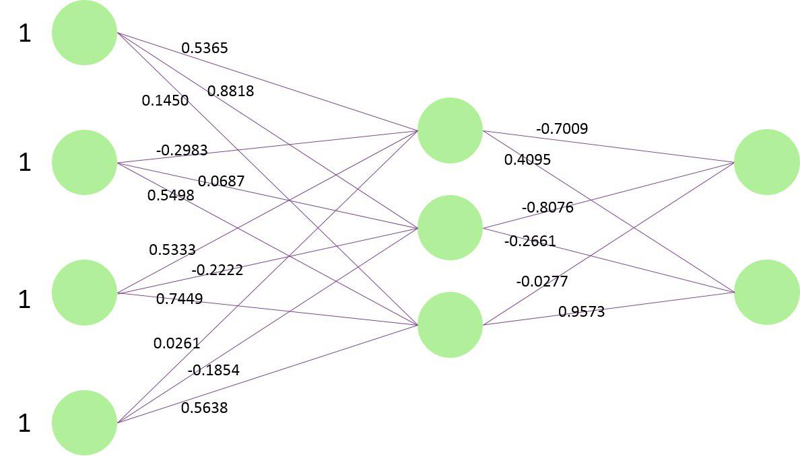

# Simple AutoEncoder

This is the simple implementation of the auto-encoder. 
You can give the specific list of hidden neuron, and it will generate the list of encode weight matrixes.
The detail demonstrated in the main.py

Usage
---
output:
```
[[ 0.53651126 -0.29827437  0.53330368  0.02605955]
 [ 0.88187076  0.06874259 -0.22215624 -0.18543087]
 [ 0.14501262  0.54984222  0.74449878  0.56380165]]

[[-0.70098514 -0.80765655 -0.02767091]
 [ 0.40949903 -0.26607841  0.95726054]]
``` 

You can regard the result as the following graph:
