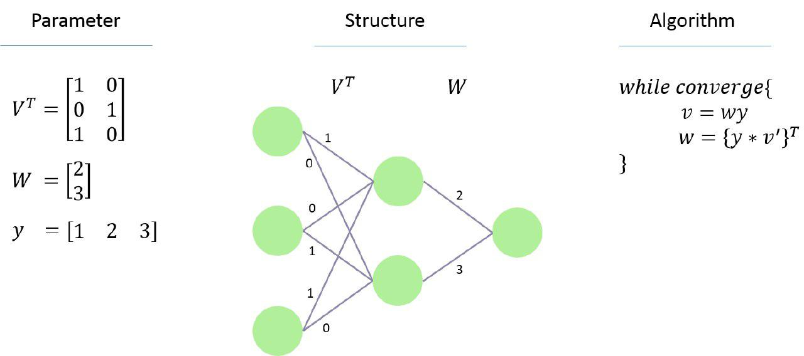
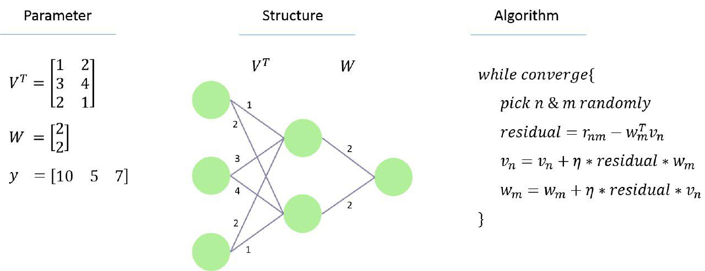

# Matrix Factorization

This folder demonstrated 2 strategy toward the matrix factorization. 
The strategy are alternating least square algorithm and the stochastic gradient decent algorithm.

Illustration
---
Alternating least square algorithm:
```
python mf_tango.py
```

<br/>



Stochastic gradient decent algorithm
```
python mf_sgd.py
```

<br/>

